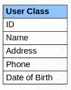
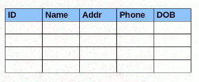

### Hibernate
*  An ORM Tool
*  Used in data layer of applications
*  Implements JPA (Java Persistance API)

### What is the problem that Hibernate is trying to solve:

           
 
 From the above first is a java object and second is a Table in DataBase (DB). Here if we want to make
 a new/update/delete USER from DB. The problem here is at DB lavel we have entities (rows) and at Java
 level we have objects.<br>
 <br>
 Normally we use **JDBC** to connect to DB from our application and execute queries on DB. But think about
 the applications which has over 100 of tables and complex schema. It becomes difficult to write direct queries.<br>
 <br>
 So the better solution is to map the entities with the java objects.<br>
 <br>
 **Points to consider while mapping the objects to entities**
 * Mapping member variables to columns (ID variable --> ID column)
 * Mapping relationships (User table may be linked to some other table)
 * Handling data types (ID may be int, Name may be varchar)
 * Mapping changes to object state.
 
This mapping of java objects to DB entities is called as **ORM(Object Relational Mapping)**. Hibernate primary
existance is to privide this mapping.

### Steps needed to save a entry in DB without Hibernate 
* JDBC database configuration
* The Model Object (create objects for respective tables)
* Service method to create a the model object (Need some method to create this object by passing parameters to it)
* Database design (DB should have respective tables for the respective Model objects)
* DAO method to save the object using queries (We need a layer/method which converts the object to query to execute on DB)


### Steps needed to save a entry in DB with Hibernate
* JDBC database configuration - Hibernate configuration (Still required to configure)
* The Model Object - Annotations (Hibernate helps creating model objects with annotations)
* Service method to create a the model object (Hibernate provides API to do this)
* Database design - NOT NEEDED (If we configure the every object right way Hibernate creates tables itself)
* DAO method to save the object using queries - NOT NEEDED (Hibernate service API takes care of it)

### Hibernate configuration details
* Hibernate by default looks for the file with name **hibernate.cfg.xml**
* dialect --> says what kind of language Hibernate use to talk to DB (The way we run queries in Oracle, postGres, mysql are different)
* hbm2ddl.auto --> This tells hibernate that while saving any object create always new schema or update the existing one
* cache.provider_class --> Hibernate [First](https://howtodoinjava.com/hibernate/understanding-hibernate-first-level-cache-with-example/) and [Second](https://www.javatpoint.com/hibernate-second-level-cache)  level Cache.
* connection.pool  --> Hibernate [Connection Pool](https://howtodoinjava.com/hibernate/hibernate-c3p0-connection-pool-configuration-tutorial/)
 

### Important points while dealing with Hibernate
* Hibernate SessionFactory creation is very expensive. So, create it only once and use across the application.
* HIbernate does not persist (create or update) or consider static fields as columns.
* Hibernate takes value from **getter** method not from **variables** of an model class for inserting into tables
**For Example : **
```
@Entity(name = "USER_INFO")
public class UserInfo {

	private Integer userId;
	private String userName;

	@Id
	@GeneratedValue(strategy = GenerationType.AUTO)
	@Column(name = "USER_ID")
	public Integer getUserId() {
		return userId;
	}

	public void setUserId(Integer userId) {
		this.userId = userId;
	}

	@Column(name = "USER_NAME")
	public String getUserName() {
		return userName;
	}

	public void setUserName(String userName) {
		this.userName = userName + " from Getter";
	}
}

```
```
public class HibernateTest {
	public static void main(String[] args) {
		
		UserInfo userInfo = new UserInfo();
		userInfo.setUserName("Manoj");
		
		SessionFactory sessionFactory = new Configuration().configure().buildSessionFactory();
		Session session = sessionFactory.openSession();
		session.beginTransaction();
		session.save(userInfo);
		session.getTransaction().commit();
	}
}
```

**Entry in DB would be**

```
+---------+------------------+
| USER_ID | USER_NAME        |
+---------+------------------+
|       1 | Manoj from Getter |
+---------+------------------+
```

### Hibernate Annotations
```
@Id
@GeneratedValue(strategy = GenerationType.AUTO)
public Integer getUserId(){..}
```
>  specifies **UserId** an Primarykey and should be autogenerated

```
@Entity
@Entity(name="USER_INFO")
public class UserInfo{...}
```
>  specifies **USER_INFO** is an Entity object name and table name is same as **USER_INFO**

```
@Entity
@Table(name="USER_DETAILS")
public class UserInfo{...}
```
> specifies **UserInfo** is an Entity object name and table name  as **USER_DETAILS**

```
@Column (name="USER_NAME")
public String getName(){..}
```
> specifies **USER_NAME** is an column name.

```
@Transient
public String name;
```
> specifies that **name** field should not be considered as a column..

```
@Lob
@Column(name = "DESCRIPTION")
public String getDescription(){..}

@Column(name = "CREATION_DATE")
public Date getCreationDate() {..}
```
> **@Lob** describes use **longtext** type and by default uses **varchar(255)** for String type

**result of `@Lob` and Date..**

```
mysql> describe USER_INFO;
+---------------+--------------+------+-----+---------+-------+
| Field         | Type         | Null | Key | Default | Extra |
+---------------+--------------+------+-----+---------+-------+
| USER_ID       | int(11)      | NO   | PRI | NULL    |       |
| CREATION_DATE | datetime(6)  | YES  |     | NULL    |       |
| DESCRIPTION   | longtext     | YES  |     | NULL    |       |
| USER_NAME     | varchar(255) | YES  |     | NULL    |       |
+---------------+--------------+------+-----+---------+-------+

mysql> select * from USER_INFO;
+---------+----------------------------+------------------+-----------+
| USER_ID | CREATION_DATE              | DESCRIPTION      | USER_NAME |
+---------+----------------------------+------------------+-----------+
|       1 | 2019-05-03 10:09:56.164000 | some description | Manoj     |
+---------+----------------------------+------------------+-----------+
```

```
@Temporal (TemporalType.DATE)
@Column(name = "CREATION_DATE")
public Date getCreationDate() {..}
```
> **@Temporal (TemporalType.DATE)** specifies to use only DATE..

```
mysql> select * from USER_INFO;
+---------+---------------+------------------+-----------+
| USER_ID | CREATION_DATE | DESCRIPTION      | USER_NAME |
+---------+---------------+------------------+-----------+
|       1 | 2019-05-03    | some description | Manoj     |
+---------+---------------+------------------+-----------+
```
```
@Temporal (TemporalType.TIME)
@Column(name = "CREATION_DATE")
public Date getCreationDate() {..}
```
> **@Temporal (TemporalType.DATE)** specifies to use only TIME..

```
mysql> select * from USER_INFO;
+---------+---------------+------------------+-----------+
| USER_ID | CREATION_DATE | DESCRIPTION      | USER_NAME |
+---------+---------------+------------------+-----------+
|       1 | 10:20:06      | some description | Manoj     |
+---------+---------------+------------------+-----------+
```

### Retrive date from DB using Hibernate

* Retrive an entry by its ID
```
session = sessionFactory.openSession();
userInfo = session.get(UserInfo.class, 1);
System.out.println("retrived userInfo with UserName:"+userInfo.getUserName());

OUTPUT: retrived userInfo with UserName:Manoj
```


