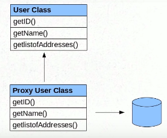

```
@Fetch
```
This annotation is used to tell Hibernate how to fetch the Entities subClasses (Child tables). By Default it will
be always ***Lazy*** meaning fetch the children only when required.<br>

```
studentInfo = null;
session = sessionFactory.openSession();
studentInfo = session.get(StudentInfo.class, 1);
System.out.println(studentInfo.getAddressSet().size());
```
From the above code, hibernate gets AddressSet only when it is called.
How does hibernate does this?<br>
It internally uses the ***PROXY*** objects to acchieve this<br>

**Explaination**<br>
When we call ``` studentInfo = session.get(StudentInfo.class, 1);```, hibernate does ont return the actual
StudentInfo object but intern returns the proxy to it. This StudentInfoProxy has all the methods whihc are in StudentInfo,
the only difference is in the method of ```getAddressSet()```.<br>
In ```getAddressSet()``` of StudentInfoProxy, there will be piece of code to query the DB to 
get its children and then returns its value.

##### How do we change this behavior 

```
@ElementCollection(fetch = FetchType.EAGER)
	@CollectionTable(name = "STUDENT_ADDRESS", joinColumns = @JoinColumn(name = "STUDENT_ID"))
	@GenericGenerator(name = "sequenceGen", strategy = "sequence")
	@CollectionId(columns = { @Column(name = "ADDRESS_ID") }, generator = "sequenceGen", type = @Type(type = "long"))
	public Collection<Address> getAddressSet() {
		return addressSet;
	}
```
By using `(fetch = FetchType.EAGER)`. Lets test the functionality of `FetchType.EAGER` and `FetchType.LAZY`<br>
**Run the code with EAGER**
```
		studentInfo = null;
		session = sessionFactory.openSession();
		studentInfo = session.get(StudentInfo.class, 1);
		session.close();
		System.out.println(studentInfo.getAddressSet().size());
```
**Output will be 2. But if we run the same code without EAGER then we will get Exception**
```
Exception in thread "main" org.hibernate.LazyInitializationException: failed to lazily initialize a collection of role: learning.hibernate.collections.StudentInfo.addressSet, could not initialize proxy - no Session
```

