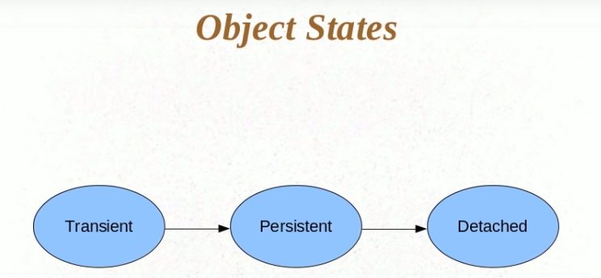
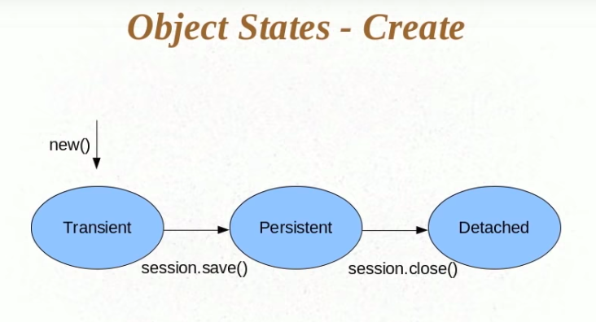
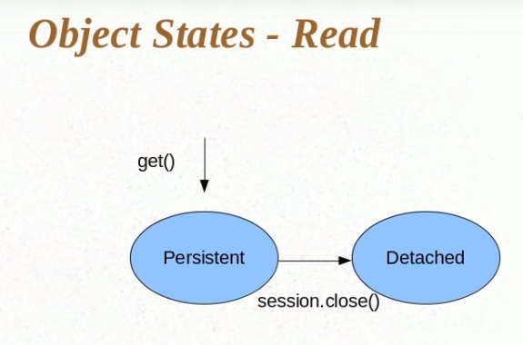
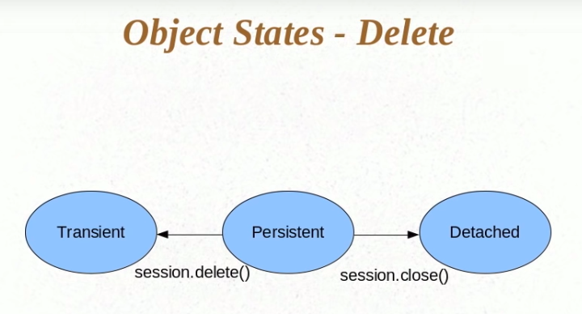

### Different types of Hibernate Object States
* Transient
* Persistent
* Detached

 

#### Transient
* An object is transient if it has just been instantiated using the new operator, and it is not associated with a Hibernate Session
* It has no persistent representation in the database and no identifier value has been assigned.
* Transient instances will be destroyed by the garbage collector if the application does not hold a reference anymore.
```
Person person = new Person();
person.setName("Foobar");
// person is in a transient state
```

#### Persistent
* A persistent instance has a representation in the database and an identifier value. Meaning object State is changed from Transient to Persistent when it is associated with the session
* It might just have been saved or loaded, however, it is by definition in the scope of a Session.
* Hibernate will detect any changes made to an object in persistent state and synchronize the state with the database when the unit of work completes.
```
Long id = (Long) session.save(person);
// person is now in a persistent state
```
#### Detached
* A detached instance is an object that has been persistent, but its Session has been closed.
* The reference to the object is still valid, of course, and the detached instance might even be modified in this state.
* A detached instance can be reattached to a new Session at a later point in time, making it (and all the modifications) persistent again.

#### Object State (Create)
* If we say new() then the object created is called it is in **Transient** state.
* If we say session.save() it will be in *Persistent* state.
* If we say session.close() it will move to **Detached** state.


#### Object State (Read)
* In read we do get(), in this case the object will be in **Persistent** state. 
* Now if we close the session, it will go to **Transient** state.


#### Object State (Delete)
* It has two flows, i.e, it can go to **Transient**(session.delete()) or **Detached**(session.close()) state based on the opeartion we do.
* Why if we do session.delete() the object state changes from **Persistent** to **Transient**? because once if we say session.delete(), the respective
entry in the DB will be deleted. So, there is no point in keeping the state in **Persistent**




