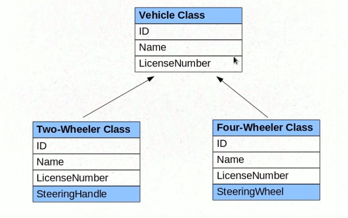
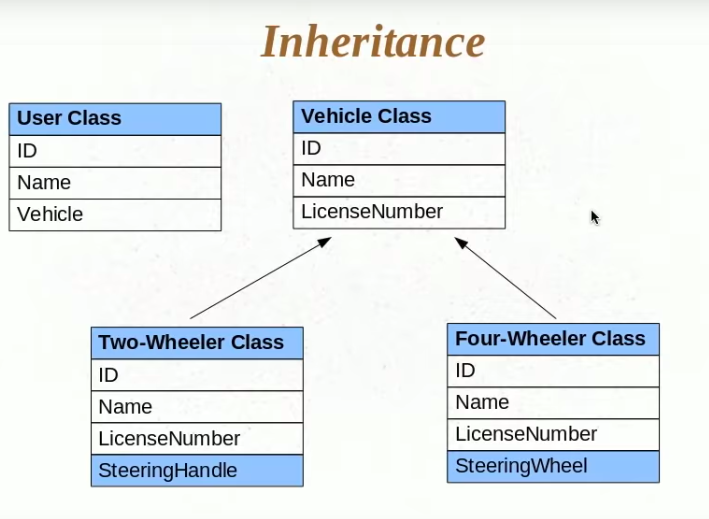

### Inheritance in Hibernate
Inheritance is very specific to Object-Oriented programming and we don't have an equivalent of Inheritance in a relational
modwl. So this is quite a challenge for any object relational mapping tool to implement inheritance of the classes to a relational table.<br>
<br>
Lets take an example an understand..

 
 
 From the above image, TwoWheeler and FourWheeler inherits Vehicle class. Now, say we have objects of this TwoWheeler, FourWheeler and Vehicle objects 
 in our application then how would hibernate save these objects in our database.
 
#### Before going forward, why we are intrested in Inheritance in Hibernate..
One coolest feature of Inheritance is **Polymorphism**. Now say we have a User object and this object has a reference to a vehicle class and say we want to 
dinamically assgn either a TwoWheeleror FourWheeler object to the User class. And it is in the runtime the actual object is injected.

 
 
 This Vehicle is place holder for both TwoWheeler and FourWheeler and we would not know until runtime what object its going to be. Due to this the problem
 arrises when we want to persist the User class then what will be the foreign key relationship, is it a Id of a TwoWheeler or Id of a FourWheeler.
 And we cannot have a foreign key relationship to both, it has to be any one of them. And we cannot decide because User have a vehicle class referenced.<br>
 <br>
  
 Its becomes tricky as our base class that is implemented in User class is a Vehicle and we want to save the relationship dynamically. This is one reason why
 we want to implement inheritance and the second reason being if we make any changes in the base class Vehicle then the changes would automatically reflect in
 both the TwoWheeler and FourWheeler classes. And this would not be possible if we treate them as seperate entities.<br>
 
 **Vehicle.java**
 ```
 @Entity(name = "VEHICLE_INHERITANCE")
public class Vehicle {

  private String name;
  private Integer id;

  @Column(name = "NAME")
  public String getName() {
    return name;
  }

  public void setName(String name) {
    this.name = name;
  }

  @Id
  @GeneratedValue(strategy = GenerationType.AUTO)
  public Integer getId() {
    return id;
  }

  public void setId(Integer id) {
    this.id = id;
  }
}
 ```
 
 **TwoWheeler.java**
 ```
 @Entity
public class TwoWheeler extends Vehicle {
  private String steeringHandle;

  public String getSteeringHandle() {
    return steeringHandle;
  }

  public void setSteeringHandle(String steeringHandle) {
    this.steeringHandle = steeringHandle;
  }
}
 ```
 **FourWheeler.java**
 ```
 @Entity
public class FourWheeler extends Vehicle {

  private String steeringWheel;

  public String getSteeringWheel() {
    return steeringWheel;
  }

  public void setSteeringWheel(String steeringWheel) {
    this.steeringWheel = steeringWheel;
  }
}
 ```
 
 **HibernateTest.java**
 ```
 public class HibernateTest {
	public static void main(String[] args) {

		Vehicle vehicle = new Vehicle();
		vehicle.setName("Some vehicle name");
		
		TwoWheeler bike = new TwoWheeler();
		bike.setName("Bike");
		bike.setSteeringHandle("Bike Steering Handle");
		
		FourWheeler car = new FourWheeler();
		car.setName("Car");
		car.setSteeringWheel("Car Steering Wheel");

		SessionFactory sessionFactory = new Configuration().configure().buildSessionFactory();
		Session session = sessionFactory.openSession();
		session.beginTransaction();
		session.save(vehicle);
		session.save(bike);
		session.save(car);
		session.getTransaction().commit();
		session.close();
	}
}
 ```
 
 **If we look at the output...**
 ```
 mysql> select * from VEHICLE_INHERITANCE;
+---------------------+----+-------------------+----------------------+--------------------+
| DTYPE               | id | NAME              | steeringHandle       | steeringWheel      |
+---------------------+----+-------------------+----------------------+--------------------+
| VEHICLE_INHERITANCE |  1 | Some vehicle name | NULL                 | NULL               |
| TwoWheeler          |  2 | Bike              | Bike Steering Handle | NULL               |
| FourWheeler         |  3 | Car               | NULL                 | Car Steering Wheel |
+---------------------+----+-------------------+----------------------+--------------------+

 ```
 * hibernate has created only one table even though we defined the TwoWheeler and FourWheeler as two Entities. Insted it mapped all of them to the base class table **VEHICLE_INHERITANCE**
 * It has created a new column called **DTYPE**, which tells the type of the object
 * Is also created two columns one for both **steeringHandle** and **steeringWheel**
 

The above default behavior of hibernate on Inheritance is called as **Single Table Strategy**<br>
<br>
##### How can we change the Name and values of  DTYPE (By default they will be the class names)
**Vehicle.java**
```
@Entity(name = "VEHICLE_INHERITANCE")
@DiscriminatorColumn(name = "VEHICLE_NAME")
@DiscriminatorValue("VEHICLE")
public class Vehicle {

  private String name;
  private Integer id;

  // Setters and Getters
}
```
**TwoWheeler.java**
```
@Entity
@DiscriminatorValue("BIKE")
public class TwoWheeler extends Vehicle {
  private String steeringHandle;

// Setters and Getters
}
```
**FourWheeler.java**
```
@Entity
@DiscriminatorValue("CAR")
public class FourWheeler extends Vehicle {

  private String steeringWheel;

// Setters and Getters
}
```

**Output will be..**
```
mysql> select * from VEHICLE_INHERITANCE;
+--------------+----+-------------------+----------------------+--------------------+
| VEHICLE_NAME | id | NAME              | steeringHandle       | steeringWheel      |
+--------------+----+-------------------+----------------------+--------------------+
| VEHICLE      |  1 | Some vehicle name | NULL                 | NULL               |
| BIKE         |  2 | Bike              | Bike Steering Handle | NULL               |
| CAR          |  3 | Car               | NULL                 | Car Steering Wheel |
+--------------+----+-------------------+----------------------+--------------------+
```

### Now we look at Table Per Class Strategy

**Vehicle.java**
```
@Entity(name = "VEHICLE_INHERITANCE_TABLE_PER_CLASS")
@Inheritance(strategy = InheritanceType.TABLE_PER_CLASS)
public class Vehicle {

  private String name;
  private Integer id;
  
  // Getters and Setters

```

**TwoWheeler.java**
```
@Entity(name = "TWO_WHEELER_VEHICLE")
public class TwoWheeler extends Vehicle {
  private String steeringHandle;

    // Getters and Setters
  }
```

**FourWheeler.java**
```
@Entity(name = "FOUR_WHEELER_VEHICLE")
public class FourWheeler extends Vehicle {

  private String steeringWheel;
    // Getters and Setters
  }
```

**Output will be ..**
```
mysql> select * from VEHICLE_INHERITANCE_TABLE_PER_CLASS;
+----+-------------------+
| id | NAME              |
+----+-------------------+
|  1 | Some vehicle name |
+----+-------------------+


mysql> select * from TWO_WHEELER_VEHICLE;
+----+------+----------------------+
| id | NAME | steeringHandle       |
+----+------+----------------------+
|  2 | Bike | Bike Steering Handle |
+----+------+----------------------+

mysql> select * from FOUR_WHEELER_VEHICLE;
+----+------+--------------------+
| id | NAME | steeringWheel      |
+----+------+--------------------+
|  3 | Car  | Car Steering Wheel |
+----+------+--------------------+
```

### Now we look at Joined Strategy
**Vehicle.java**
```
@Entity(name = "VEHICLE_INHERITANCE_JOINED")
@Inheritance(strategy = InheritanceType.JOINED)
public class Vehicle {

  private String name;
  private Integer id;
  
  // Getters and Setters

```

**TwoWheeler.java**
```
@Entity(name = "TWO_WHEELER_VEHICLE_JOINED")
public class TwoWheeler extends Vehicle {
  private String steeringHandle;

    // Getters and Setters
  }
```

**FourWheeler.java**
```
@Entity(name = "FOUR_WHEELER_VEHICLE_JOINED")
public class FourWheeler extends Vehicle {

  private String steeringWheel;
    // Getters and Setters
  }
```
**Output will be..**
```
mysql> select * from VEHICLE_INHERITANCE_JOINED;
+----+-------------------+
| id | NAME              |
+----+-------------------+
|  1 | Some vehicle name |
|  2 | Bike              |
|  3 | Car               |
+----+-------------------+

mysql> select * from TWO_WHEELER_VEHICLE_JOINED;
+----------------------+----+
| steeringHandle       | id |
+----------------------+----+
| Bike Steering Handle |  2 |
+----------------------+----+

mysql> select * from FOUR_WHEELER_VEHICLE_JOINED;
+--------------------+----+
| steeringWheel      | id |
+--------------------+----+
| Car Steering Wheel |  3 |
+--------------------+----+
```

 