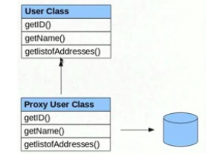

Hibernate Session class provides two method to access object 
* session.get()
* session.load()

Both looked quite similar to each other but there are subtle difference between load and get method which can affect performance of application.<br>
<br>
Main difference between get() vs load method is that..<br>
* get() involves database hit if object doesn't exists in Session Cache and returns a fully initialized object which may involve several database call.
* load() method can return proxy in place and only initialize the object or hit the database if any method other than getId() is called on persistent or entity object. This lazy initialization can save couple of database round-trip which result in better performance. 

#### 1. Behavior when Object is not found in Session Cache
Apart from performance this is another difference between get and load which is worth remembering. 
get() method of Hibernate Session class returns **null** if object is not found in cache as well as on database while 
load() method throws **ObjectNotFoundException** if object is not found on cache as well as on database but never return null.

#### 2. Database hit
Get method always hit database while load() method may not always hit the database, depending upon which method is called.

#### 3. Proxy
Get method never returns a proxy, it either returns null or fully initialized Object,
while load() method may return proxy, which is the object with ID but without initializing other properties, which is lazily initialized.
If you are just using returned object for creating relationship and only need Id then load() is the way to go.

* What is proxy?

Proxy means, hibernate will prepare some fake object with given identifier value in the memory without hitting a database.
 

If we call 
```
session.load(Student.class,new Integer(107));
```

* hibernate will create one fake Student object [row] in the memory with id 107, but remaining properties of Student class will not even be initialized.
* It will hit the database only when we try to retrieve the other properties of Student object i.e,  Name, etc.
If we call s2.getName() then hibernate will hit the database and search the row with student id 107 and retrieve the values,
if object [row] not found in the database it will throws ObjectNotFoundException

#### 4. Performance
By far most important difference between get and load in my opinion. 
get method will return a completely initialized object if  Object is not on the cache but exists on Database, 
which may involve multiple round-trips to database based upon object relational mappings while 
load() method of Hibernate can return a proxy which can be initialized on demand (lazy initialization) 
when a non identifier method is accessed. Due to above reason use of load method will result in slightly 
better performance, but there is a caveat that proxy object will throw ObjectNotFoundException 
later if corresponding row doesn’t exists in database, instead of failing immediately so not a fail fast behavior.

#### ........ Respresenting get() functionality ......
 
 
#### ........ Respresenting load() functionality ......
 

#### When to use Session get() and load() in Hibernate

1. Use get method to determine if an instance exists or not because it can return null if instance doesn’t exists in cache and database and use load method to retrieve instance only if you think that instance should exists and non availability is an error condition.

2.  As stated in difference number 2 between get and load in Hibernate. get() method could suffer performance penalty if only identifier method like getId()  is accessed. So consider using load method  if  your code doesn't access any method other than identifier or you are OK with lazy initialization of object, if persistent object is not in Session Cache because load() can return proxy.


### Other concepts...
- [First Level Cache](https://howtodoinjava.com/hibernate/understanding-hibernate-first-level-cache-with-example/)
- [Secod Level Cache](https://howtodoinjava.com/hibernate/how-hibernate-second-level-cache-works/)
- [Difference between merge and refresh](https://howtodoinjava.com/hibernate/merging-and-refreshing-hibernate-entities/)
- [Difference between save and saveOrUpdate](https://howtodoinjava.com/hibernate/hibernate-save-and-saveorupdate/)
- [Difference between save and persist](https://www.quora.com/What-is-the-difference-between-save-and-persist-in-Hibernate)
- [Difference between flush and save](https://www.quora.com/What-is-the-difference-between-flush-and-save-methods-in-hibernate-java)
- [Difference between save and saveOrUpdate](https://www.quora.com/What-is-the-main-and-most-important-between-save-and-saveOrUpdate-method-in-Hibernate)
- [Difference between JPA and Hibernate](https://www.quora.com/What-is-the-difference-between-Hibernate-and-JPA)
- [Difference between Hibernate and JDBC](https://www.javagf.com/hibernate-better-jdbc)
- [Difference between Hibernate Delete and remove](https://stackoverflow.com/questions/1476471/what-is-the-difference-between-remove-and-delete)
- [Hibernate Cache mechanism](https://www.quora.com/What-is-the-Hibernate-Cache-mechanism)
- [Hibernate Bacth Insert and Updates](https://www.baeldung.com/jpa-hibernate-batch-insert-update)
- [Hibernate @Transient annotaion](https://www.quora.com/What-is-Transient-in-Hibernate-What-is-use-of-this)
- [Difference between @Entity and @Table](https://forum.hibernate.org/viewtopic.php?f=9&t=981602)
- [Difference between one-to-many and many-to-one](https://www.quora.com/What-is-the-difference-between-one-to-many-and-many-to-one-in-Hibernate)
- [Different cascade taypes](https://howtodoinjava.com/hibernate/hibernate-jpa-cascade-types/)
- [SessionFactory vs Session](http://netsurfingzone.com/sessionfactory-and-session-in-hibernate/)
- [Transactions in Hiernate](http://netsurfingzone.com/what-is-transaction-management-in-hibernate/)
- [HQL vs SQL](http://www.differencebetween.net/technology/software-technology/difference-between-sql-and-hql/)
- [@Version vs @Audited](https://stackoverflow.com/questions/13374604/when-to-use-version-and-audited-in-hibernate)
- [HIbernate inheritance](https://www.baeldung.com/hibernate-inheritance)
- [Hobernate inheritance](https://examples.javacodegeeks.com/hibernate-inheritance-mapping-example/)
- [ACID](https://www.ibm.com/support/knowledgecenter/SSGMCP_5.4.0/product-overview/acid.html)


